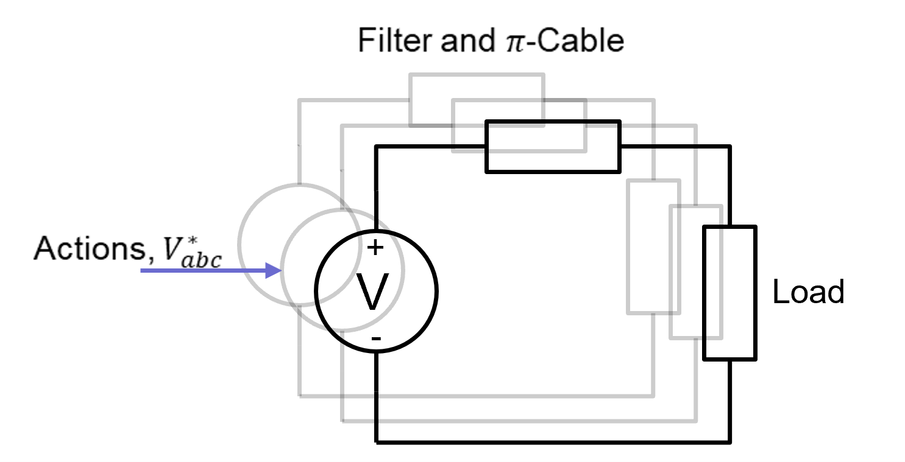

# __Classical Controllers Introduction__

- There are a number of in-built "classically" control modes, which can be applied to the voltage sources. 
- Voltage sources typically represent idealised effective models (or averaged models) of power electronic converters.

Classically controlled modes:

|  | Mode | Description |
| --- | --- | --- |
| 1 | __"Swing"__ | Ideal voltage source without dynamics (i.e. an Infinite Bus) |
| 2 | "PQ" | Grid following controllable source/load (real and imaginary power) |
| 3 | "Droop" | Simple grid forming with power balancing through a droop mechanism |
| 4 | "Synchronverter" or "VSG"|  Grid forming control mimicking a generator, i.e. Virtual Synchronous Generator |


## Swing Mode - Infinite Bus


- This example is intended to introduce you to the simplest control mode available, i.e. "open-loop" control. 
- One source, a purely oscillating voltage source, that is generating a 3-phase AC signal while connected to a static load through a cable.
- Plotting of classial controller electrical quantities.





```julia
using JEG
```


_______________________________________________________________________________
### Network Configuration 

- We specify the control mode of the source as "Swing", often referred to as an infinite bus. 
- This is open-loop control of the source, where the output voltage magnitude, relative angle, and frequency at the source terminals are fixed.


```julia
# total run time, seconds
t_end = 0.1     

# Connectivity Matrix
CM = [ 0. 1.
        -1. 0.]     

parameters = Dict{Any, Any}(
        "source" => Any[
                        Dict{Any, Any}("pwr"   => 100e3,    # Power Rating [VAr]
                                        "mode" => "Swing",  # Controller mode
                                        "v_pu_set" => 1.05, # Voltage set point [per unit]
                                        "v_δ_set" => 20.0), # Angle set point [degrees]
                        ],
        "load"   => Any[
                        Dict{Any, Any}("impedance" => "RL", 
                                        "R" => 3.73, 
                                        "L" => 0.019),
                        ],
        "cable"   => Any[
                        Dict{Any, Any}("R" => 0.1, 
                                        "L" => 0.25e-3, 
                                        "C" => 0.1e-4),
                        ],
        "grid"   => Dict{Any, Any}("f_grid" => 60.0,        # Nominal grid frequency [Hz]
                                    "ramp_end" => 0.04,     # Ramp up time to voltage set point [s]
                                    "v_rms" => 230)         # Nominal grid voltage line-to-neutral [V]
    );
```

_______________________________________________________________________________
###  Defining the environment


```julia
env = ElectricGridEnv(CM = CM, parameters = parameters, t_end = t_end, verbosity = 2);
```

    [ Info: Normalization is done based on the defined parameter limits.
    [ Info: Time simulation run time: 0.1 [s] ~> 1001 steps
    

_______________________________________________________________________________
### Initialising the agents 

All sources are controlled within the reinforcement learning framework, even if the control mode selected for the source does not entail any "learning" or "training" of the control structure. 

If not specified by the user, for all the classically controlled "agents", the function SetupAgents computes all the necessary coefficients for control.


```julia
agent = SetupAgents(env);
```

    [ Info: 1 'classically' controlled source has been initialised.
    [ Info: 1 source has been set up in Swing mode.
    [ Info: All 'classically' controlled sources have been automatically set up with droop coeficients, and proportional and integral gains.
    

_______________________________________________________________________________
### Running the time simulation 

- The system is evolved for the specified amount of time, controller actions are computed, and the results are stored in a "hook". 
- Most relevant quantities are automatically collected, however by passing a DataHook to the "simulate" function, signals may be specified.


```julia
hook = Simulate(agent, env);
```

_______________________________________________________________________________
### Under the Hood

- The software solves the electrical network in the time domain using a set of Linear Time Invariant ODEs.
- The source voltage (action) and current through the filter inductor (state) of phase 'a' is shown below.


```julia
RenderHookResults(hook = hook, 
                    states_to_plot  = ["source1_i_L1_a"], # Inductor current [A]
                    actions_to_plot = ["source1_u_a"],    # Source voltage [V]
                    )
```


_______________________________________________________________________________
### High-Level Plotting

- When sources are classically controlled and the network is a 3 phase system, the user has the option of plotting a number of additional quantities. 
- The only quantities that can be plotted for Reinforcement Learning controllers are those specified through "states_to_plot" and "actions"to_plot".
- The elements of the vectors in the function "plot_hook_result" refer to the _name_ of the classically controlled source which may differ if there are RL sources in the network, e.g. power_p_inv = [1], indicates that the real power of the first _classically_ controlled source should be plotted.


```julia
RenderHookResults(hook = hook, 
                    states_to_plot  = [], 
                    actions_to_plot = [],  
                    power_p_inv     = [1], # Real power [Watts]
                    power_q_inv     = [1], # Imaginary power [VAi]
                    v_mag_inv       = [1], # Scaled L₂ norm in αβγ coordinates [V]
                    i_mag_inv       = [1], # Scaled L₂ norm in αβγ coordinates [A]
                    angles          = [1], # Relative angle [degrees]
                    freq            = [1], # Angular velocity [Hz]
                    )
```


_______________________________________________________________________________
### Analysis

- The plot shows the instantaneous 3-phase real [W] and imaginary [VAi] power delivered by the source. 
- The frequency is a constant 60 [Hz].
- The relative positive phase sequence angle at the terminals of the source are 20 [degrees].
- The voltage at the source terminals ramps up to a magnitude of 1.05*230 [V].


```julia

```
